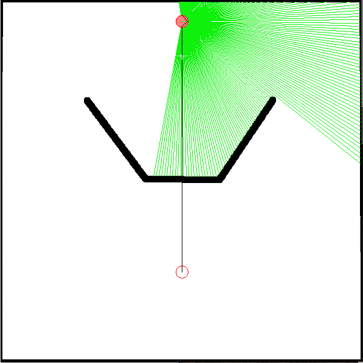
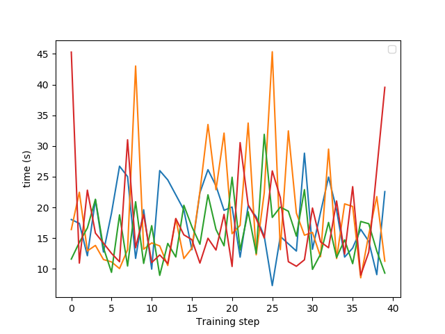

# TME-NavigationStrategies

**IAR - 2020 : le TME est à me rendre à la fin de la 2e séance, à 13h au plus tard !**

## Contexte

Ce TME requiert l'installation de [pyfastsim](https://github.com/alexendy/pyfastsim), une interface python du simulateur très léger [fastsim](https://github.com/jbmouret/libfastsim).

C'est un complément des cours sur les stratégies multiples de navigation et sur l'apprentissage par renforcement.

Il est pensé pour occuper une première séance de 2 heures de découverte et de début de mise en place du code, et d'une 2e séance de 4h, notée, servant principalement à acquérir les données, à les analyser et à produire le document de réponse aux questions.

## Présentation générale

L’objectif de ce TME est de tester plusieurs méthodes de coordination de stratégies de navigation pour un robot doté de deux stratégies simples, en quantifiant leur efficacité dans un environnement où la coopération de ces stratégies est nécessaire.

Deux stratégies de navigation sont pré-programmées :
* Un suivi de mur (wallFollower.py) qui maintient le robot à distance des murs (trop près, il s'en éloigne, trop loin il s'en rapproche), tourne sur lui-même à la recherche d'un mur s'il n'y en a pas à proximité, ou s'il a un obstacle devant lui.
* Une approche de balise (radarGuidance.py) qui oriente le robot vers une balise dont la direction est fournie, mais qui n'évite pas les obstacles.

Elles sont testables de manière isolée en lançant ```python wallFollower.py``` et ```python radarGuidance.py```. La coordination des deux stratégies est à coder dans ```strategyGating.py```, qui contient déjà le code permettant de lancer la simulation, de récupérer les données des senseurs, de les transformer en un identifiant d'état (voir plus loin), de téléporter le robot lorsqu'il arrive au but (et de le récompenser), de le punir lorsqu'il approche trop d'un mur, et de répéter les opérations jusqu'à l'obtention de 40 récompenses.

## Description du problème



L’environnement utilisé est composé d’une arène carrée (600x600 pixels) comprenant un obstacle, et un but. Ce but est de type goal dans fastsim, ce qui veut dire qu’il s’agit d’une balise dont la direction peut être détectée par un senseur de type radar, même à travers les murs.

Le robot est équipé des capteurs suivants :
- un télémètre laser de 200 degrés d’ouverture, fournissant une mesure de distance tous les degrés,
- des détecteurs de contact droite et gauche,
- un radar capable de détecter la direction du but dans l’un des 8 secteurs autour du robot,
- un capteur grossier de distance de la balise (0 : proche, 1 : moyenne, 2 : éloignée) est simulé à partir de la position du robot produite par le simulateur, elle est utilisée dans la définition d'état pour l'apprentissage.

Le robot démarre toujours la simulation à la position (300,35).

L’obstacle en forme de U fait qu’un robot utilisant la stratégie d’approche de balise seule va y rester coincé.
De la même façon, la stratégie de suivi de mur va soit faire tourner le robot autour de l’arène, soit autour de l’obstacle, sans lui permettre d’atteindre le but. Il va donc être nécessaire de coordonner l’usage de ces deux stratégies afin de résoudre la tâche dans un temps raisonnable.

```strategyGating.py``` est conçu pour que, par défaut, lorsque le robot atteint le but, il soit téléporté à son point de départ. Cette téléportation marque la fin d’un « essai » (trial), le programme s’arrête de lui-même lorsque ce nombre d’essais atteint la valeur nbTrials (40), que vous pouvez donc modifier selon vos besoins. Chaque fois que le robot atteint le but la variable de récompense ```rew``` passe à 1 et chaque fois qu’il percute un mur, elle passe à -1. **C’est à la méthode d’arbitrage (que l'on va programmer) de remettre cette valeur à 0 lorsque l’information a été traitée.**

## Résultats d'expérimentation

### Aparté sur certains choix de conception : 
Avant de commencer a détailler les résultats obtenus je tiens a revenir sur quelques choix de conception afin de dissiper toute ambiguité quant a l'efficacité des méthodes que l'on va critiquer dans la suite : 
- D'abord, mon code fait la supposition que les états sont discrets mais que en plus ils sont tous énumérables, ainsi la Q-Table est construite au début de l'exécution et est mise a jour par la suite.
- Mon code suppose également que le simulateur tourne a un mouvement par 0.01 secondes.
### Analyse de l'approche benchmark "random-persist" : 
En analysant les résultats donnés l'approche randomPersiste un constat important est a faire :
L'une des stratégies optimale du robot est de faire un radarGating, puis un wallFollowing et enfin un radarGating pendant chacun 2 sec, le choix du nombre de secondes durant laquelle faire persister l'action est donc biaisé en faveur de cette approche car il lui permet avec une probabilité de 1/8 de générer une politique optimale, un autre choix de durée inférieure conduit a une dégradation significative des résultats.
Ainsi on obtient sur pour une exécution donnée : 
- mediane : 15.773118734359741s 
- premier quartile : 11.594132959842682s 
- troisième quartile : 27.77677470445633s

On note cependant que le minimum qui correspond au temps pris par un robot qui adopte la politique précédente est atteint, cette politique est même suivi deux fois durant cette éxécution et elle donne dans les 8.7s de temps d'éxécution pour le meilleur cas.
### Analyse de l'approche obtenu en utilisant une Q-Table : 
D'abord le premier constat a faire c'est que le temps de délibération pris par l'agent n'a pas d'influence sur les résultats étant donné qu'il est extrêmement court, ensuite, la formalisation du problème fait emerger durant l'apprentissage plusieurs comportement qui entravent l'optimisation de la fonction objectif : le temps.
- D'abord, il arrive que le mécanisme de changement obligatoire de choix provoque des mouvements par a coups, quand ces mouvement se produisent au fond de l'entonnoir ça conduit le robot a des collisions quelque soit la stratégie qu'il prend.
- Ensuite, il est a noter que la fonction récompense ne prend pas en compte la fonction objectif, ainsi elle a été défini arbitrairement pour éviter les collisions ce qui est sensé permettre d'atteindre la fin plus rapidement mais en pratique rien ne pénalise un robot qui passerait son temps a simplement explorer en évitant l'entonnoir, heureusement grâce au mécanisme d'exploration du softmax cela ne se produit pas.

**A présent Quid des performances ?**
Au début on obtient les performances cumulées suivantes (trois premiers quartiles) : 
- 63.04927521944046 soit une moyenne de 15.7  
- 65.91398525238037 soit une moyenne de 16.2  
- 77.76033812761307 soit une moyenne de 19.25  
Je suis assez fiére de ce résultat car il montre bien que au début l'approche est relativement similaire a une approche purement aléatoire.
- 59.12012094259262 qui donne une moyenne de 14.75  
- 62.146416664123535 soit une moyenne de 15.5   
- 69.33094066381454 donc une moyenne de 17.25  
Et donc on constate une amélioration sur les 3 mesures mais également et surtout une baisse significative de la variance.
A noter également que cet agent se base sur une description de son environnement qui est généralisable on s'attend donc a ce que cet agent s'adapte bien mieux a d'autres environnements. \\


La courbe en revanche est beaucoup moins expressive, on voit bien que les performances s'améliore globalement a la fin de l'apprentissage mais c'est trés bruité, on note cependant que la remarque qu'on a faite sur la fonction récompense se voit bien expérimentalement dans la mesure ou les "outlier points" de la courbe correspondent a des itérations ou l'agent a fait des tours dans le vide. \\
#### Analyse de certaines entrées de la Q-Table
- 00002 : Pas d'obstacle et objectif en vue \\
Q(00002, Radar) = 0.095 \\
Q(00002, WallFollowing) = -0.222 \\
Donc la en pratique ça veut dire que si le robot ne voit pas d'obstacle il se dirige vers la récompense si il la voit.\\

- 00072 : Pas de vision sur l'objet \\
Q(00072, Radar) = -0.082 \\ 
Q(00072, WallFollowing) = 0.055 \\
Pas vraiment de différence mais a priori le wall following est priorisé car il a certainement du permettre au robot d'éviter les récompense négatives quand il était bloqué dans l'entonnoir. \\

- Ces deux états représente le cas ou il y'a énormement d'obstacles en vu et a priori il utilise la politique du radar ce qui n'est pas logique, mais en réalité ça a certainement du lui servir quand il était au bord de l'entonnoir. \\
Q(11101, 0) = -1.255 \\
Q(11101, 1) = -2.025 \\
Q(11171, 0) = -0.247 \\
Q(11171, 1) = -2.395 \\
